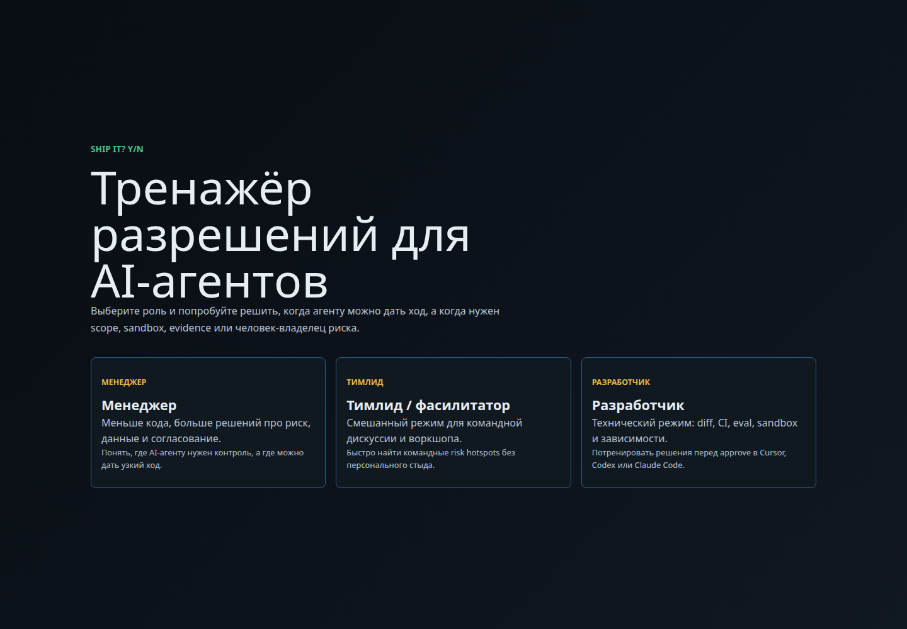
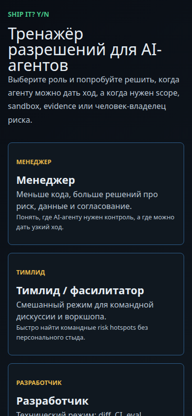

# Ship It? Y/N - AI Permission Judgment Game

**Ship It? Y/N** is the public front door for AI Rollout Training OS: a browser-based permission judgment game for teams adopting Cursor, Codex, Claude Code, and other agentic coding tools.

It is not a generic LMS, not a compliance certificate, and not a real agent runner. The game teaches one narrow habit: deciding whether an AI agent request should be approved, denied, scoped down, sandboxed, evaluated, escalated, or inspected before action.

Local demo route: `/demo/ship-it-yn`

Default player experience is now Russian-first with role selection:
`Менеджер`, `Тимлид / фасилитатор`, and `Разработчик`. Manager mode uses
less technical scenarios for buyer/community testing, while Developer mode keeps
the deeper diff/CI/eval/sandbox flow.

Primary CTA: build the React/Vite game, start FastAPI, and open `http://127.0.0.1:8000/demo/ship-it-yn`.

```bash
cd frontend/permission_game
npm install
npm run build
cd ../..
.venv/bin/uvicorn ai_rollout_os.main:app --host 127.0.0.1 --port 8000
```

Reference integration: `docs/entropy_core_gensyn_integration.md`.

## Зачем

Команды все чаще работают с Cursor, Codex, Claude Code и похожими агентными инструментами, но ключевой риск появляется не в prompt writing. Он появляется в моменте разрешения действия:

- можно ли читать `.env` или логи с секретами;
- стоит ли запускать команду с широким filesystem impact;
- можно ли менять package scripts, CI workflow или миграции;
- когда нужен sandbox вместо прямого approve;
- когда запрос неполный и нужно уточнение или escalation.

Цель v1 - дать команде короткий, визуальный и showable тренажер: scenario card -> decision -> consequence -> lesson. Первый monetizable artifact - workshop/demo pack для команд, которые внедряют AI agents и хотят снизить unsafe approvals без тяжелой платформенной продажи.

## Для кого

- Engineering team leads who need a fast way to discuss AI agent permission risk.
- AI rollout facilitators running a workshop or team demo.
- Developers using agentic coding tools who want practice before approving broad actions.
- Security or platform reviewers who want a concrete conversation starter, not another policy PDF.

## Что строим в v1

V1 - Agent Permission Training Simulator.

Основной workflow:

1. Learner получает визуальный scenario card с agent request и рабочим контекстом.
2. Learner выбирает approve, deny, ask for clarification, run in sandbox или escalate to reviewer.
3. Simulator показывает consequence, risk category, safer alternative и lesson.
4. Score объясняет, был ли выбор allowed, needs approval, blocked или unknown.
5. Workshop/demo pack собирает сценарии и summary для team lead или facilitator.

Стартовая библиотека сценариев покрывает secrets, command surfaces, test-output injection, package scripts, CI edits, out-of-scope refactors, network calls, deletes, dependency installs и log exposure.

Существующий backend, audit, retrieval и manager-approval контур остаются полезной базой для будущего governed rollout product, но они не должны уводить v1 обратно в generic course или LMS.

## Public demo: Ship It? Y/N

Ship It? Y/N - публичная React/Vite мини-игра для тренировки permission judgment на семи уровнях. Локальный маршрут: `/demo/ship-it-yn`.

Try the local demo: `http://127.0.0.1:8000/demo/ship-it-yn`.

Desktop browser artifact:



Mobile browser artifact:



## Blocked claims

The public demo is intentionally bounded:

- No certified safety claim.
- No compliance approval claim.
- No production readiness claim.
- No PMF, paid conversion, or customer adoption claim.
- No autonomous execution or real privileged-action approval claim.

## Гипотеза

Мы проверяем не то, "повышает ли AI продуктивность вообще". Проверяем более узкую гипотезу:

> Если команды тренируются на визуальных permission scenarios с последствиями, safer alternatives и scoring, то они быстрее научатся отличать safe approve от actions that need sandbox, clarification, reviewer approval, or blocking.

Минимальный success signal для v1:

- learner correctly classifies risky agent requests across allowed, needs approval, blocked и unknown;
- scenario feedback teaches a concrete safer path, not generic prompt advice;
- facilitator can run a polished demo/workshop without custom backend setup;
- team lead can see which risk categories cause unsafe approvals;
- product can be sold or tested as a focused workshop/demo pack before platform expansion.

## Что хотим проверить

Продуктовая проверка:

- Понятны ли agent permission scenarios без длинного курса.
- Какие risk categories чаще всего приводят к unsafe approve.
- Помогает ли visual consequence + lesson лучше, чем checklist или policy page.
- Достаточно ли 10-20 качественных сценариев для paid workshop.
- Можно ли показать ценность за минуты, а не после enterprise onboarding.

Техническая проверка:

- Можно ли держать scenario validation deterministic.
- Можно ли расширять scenario library без размывания boundary taxonomy.
- Можно ли позже подключить policy-grounded retrieval без нарушения `insufficient_evidence`.
- Можно ли использовать существующие audit/scoring primitives без тяжелого LMS workflow.

Операционная проверка:

- Как facilitator использует simulator in workshop mode.
- Какие summary metrics нужны team lead after a session.
- Где проходит граница между automated lesson и human-owned approval.

## Не цели v1

В v1 проект не пытается:

- строить generic AI course или prompt library;
- делать LMS, HRIS или enterprise certification workflow;
- доказывать productivity gains;
- запускать autonomous agents или LLM-directed tools;
- автоматически разрешать реальные privileged actions;
- заменять security, legal, manager или reviewer approval;
- делать compliance attestation для HIPAA, SOC 2, PCI-DSS или GDPR.

## Архитектурные решения

- Backend: FastAPI.
- State: PostgreSQL.
- Retrieval: PostgreSQL + pgvector, text-only corpus.
- RAG eval: `docs/retrieval_eval.md`.
- Workflow: deterministic state transitions + bounded LLM calls.
- Execution model: current Codex session, no external AI worker process.
- RAG implementation reference: `docs/reference/dream_motif_rag_reuse.md`.

Подробности:

- Architecture: `docs/ARCHITECTURE.md`
- Specification: `docs/spec.md`
- Tasks: `docs/tasks.md`
- Implementation contract: `docs/IMPLEMENTATION_CONTRACT.md`
- Session state: `docs/CODEX_PROMPT.md`
- Phase 1 audit: `docs/audit/PHASE1_AUDIT.md`

## Текущий план реализации

MVP foundation описан в `docs/tasks.md`. Текущая активная работа идет по Post-MVP production maturity graph в `docs/product_maturity_task_graph.md`, Phase 20.

Разработка должна идти в nonstop loop: Codex выполняет задачу, проверяет, делает review pass, обновляет state, проходит phase boundary checks и сразу берет следующую задачу. Между фазами нет ручной паузы, если проверки прошли и нет P0/P1 blockers. Остановка допустима только на реальном blocker, требуемом human decision или явной команде pause.

Активный блок:

1. `T92: FastAPI Static Game Route`
2. `T93: Responsive Visual Polish`
3. `T94: Motion And Accessibility Pass`
4. `T95: Full Public Game Browser E2E`
5. `T96: Screenshot And README Visual Artifact`

## Критерий полезности v1

V1 считается перспективным, если можно показать:

- polished visual scenario flow;
- realistic permission decisions across core risk categories;
- deterministic scoring and safer alternatives;
- team/session summary of unsafe approvals and improvement areas;
- workshop/demo pack that a buyer can understand without platform onboarding.

Если продукт снова превращается в generic training portal before simulator works, pivot считается сорванным.
